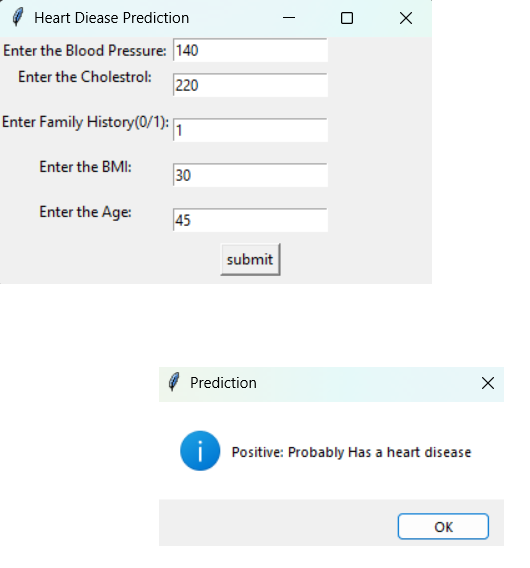
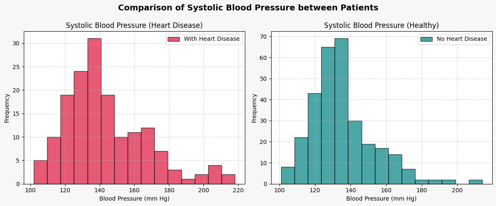
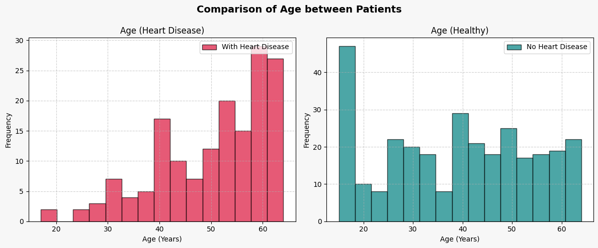
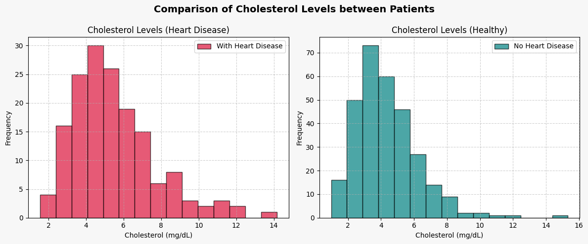
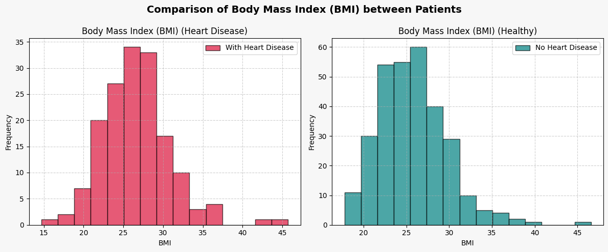

# Heart Disease Prediction using Machine Learning
Predict heart disease risk using machine learning and patient health data — with visualizations and a GUI interface.

## 📘 Project Description

Heart disease is one of the leading causes of death globally. The goal of this project is to build a predictive model that determines whether a patient is likely to suffer from heart disease based on key health indicators such as blood pressure, cholesterol, BMI, age, and family history. The training and testing datasets used in this project (`CSV_Files` folder) were downloaded from `Kaggle`.

This project is a desktop-based heart disease prediction tool that:

- Trains a **Decision Tree Classifier** on labeled heart health data.
- Uses a **Tkinter GUI** for user input.
- Predicts whether a patient is likely to have heart disease.
- Visualizes distributions of features like Blood Pressure, Cholesterol, Age, and BMI.
- Outputs a decision tree graph (`tree.dot`) for interpretability.

---

## ⚙️ Installation Instructions

1. **Clone the Repository**

   ```bash
   git clone https://github.com/yourusername/Heart-disease-prediction-using-ML.git
   cd Heart-disease-prediction-using-ML
   ```

2. **(Optional) Create and activate a virtual environment**

    ```bash
   python -m venv venv
   source venv/bin/activate      # On Windows: venv\Scripts\activate  
   ```

3. **Install the dependencies**

    ```bash
   pip install -r requirements.txt 
   ```

4. **Run the application**

    ```bash
   python main.py
   ```

---

## Sample UI Screenshots and Plots



### Systolic Blood Pressure Distribution


### Age Distribution


### Cholesterol Levels


### Body Mass Index (BMI)
